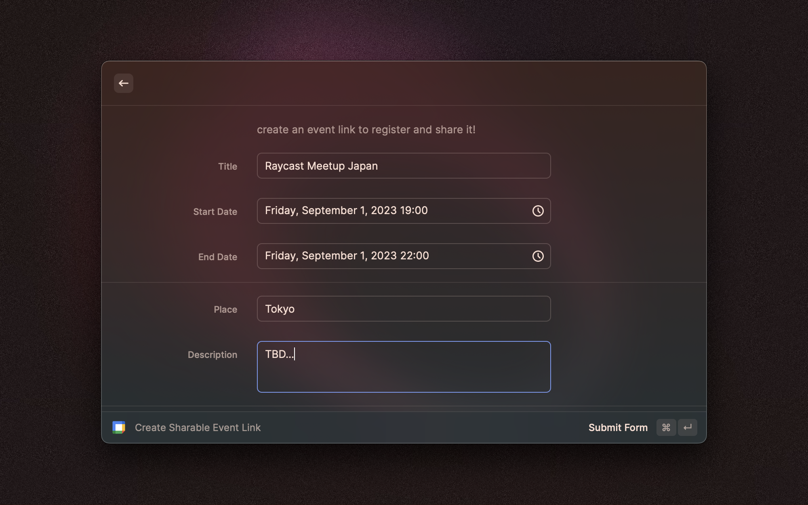

# Google Calender

Search and Create a event-link for anyone to subscribe!

## Create Event Link Feature
Create a event-link for anyone to subscribe to their Google Calender.
1. create event link like below.

1. after `cmd` + `enter`, you can see below which you can share anyone.
every one registrate the event to thier Google Calender.

## Search Events Feature
### How to get a Gmail OAuth Client ID

For now you need to create your own OAuth Client ID to be able to use this extension.
Getting a production enabled OAuth Client ID is complicated but is planned in the future.

⚠️ The following description can change over time. Make sure to obtain an `OAuth key` and not an `API key`!
You can search on Google or YouTube to get a better process description like e.g. [this blog post](https://stateful.com/blog/gmail-api-node-tutorial).

- Goto [Google Developers Console](https://console.developers.google.com)

  Make sure that you logged in with the Google Account which will be associated with your new OAuth key

- Create a project and named it e.g. `Raycast`

  This step take some seconds until the project is created.

- Enable the `Gmail API`

  1. Click [here](https://console.cloud.google.com/apis/library/gmail.googleapis.com)
  2. Press the `Enable` button

- Enable OAuth

  1. Click [here](https://console.cloud.google.com/apis/dashboard)
  2. Click on `OAuth consent screen` on the left side
  3. Check `External` and click `Create`
  4. In `App Name` type `Raycast`
  5. In `User Support Mail` type your own email address
  6. In `Developer Contact Info` type your own email address
  7. Press `Save and Continue`
  8. Goto to `Test Users` and add the email address you wanna manage via Raycast
  9. Click on `Credentials` on the left side
  10. Click on the `Create Credentials` on the top (blue text)
  11. Press `OAuth client ID`
  12. In `Application Type` choose `iOS`
  13. In `Name` type `Raycast`
  14. In `Bundle ID` type `com.raycast`
  15. Press `Create`
  16. Now copy and paste the shown Client ID into the Preferences of this extension

Now you should be able to manage your Gmail account with Raycast.

## Roadmap
1. Create Event Link Feature(implemented), Search list of events feature
1. Creat and edit events feature

## special thanks
I built this extension referred to the extension below by [tonka3000](https://www.raycast.com/tonka3000) and [elliotdes](https://www.raycast.com/elliotdes)
[gmail extension](https://www.raycast.com/tonka3000/gmail)
[google-tasks](https://www.raycast.com/elliotdes/google-tasks)

`How to get a Gmail OAuth Client ID` section quoted by [README.md](https://github.com/raycast/extensions/blob/ce2f3f0d516c857bd234d0f268ad7347edab0e19/extensions/gmail/README.md)